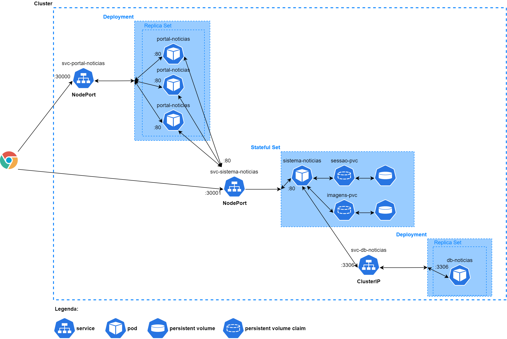

# Curso de Kubernetes

Curso introdutório de Kubernetes.

O que foi utilizado para realizar o curso:
- Docker 20.10.6;
- Kubernetes habilitado (caso do Docker Desktop em ambiente Windows).

Conceitos estudados:
- Comandos básicos com `kubectl`;
- *Pods*;
- *Nodes* e *Control Pane*;
- *Services* e seus tipos: *ClusterIP*, *NodeIP* e *LoadBalancer*;
- *ConfigMap*;
- *ReplicaSet*;
- *Deployment*;
- *Stateful Set*
- *PersistentVolume* e *PersistentVolumeClaim*;
- *Storage class*.

Em um primeiro momento temos a configuração do cluster abaixo

Os arquivos que montam o cluster acima são (os arquivos de configmap devem ser executados antes dos pods):
- svc-portal-noticias.yaml;
- svc-sistema-noticias.yaml;
- svc-db-noticias.yaml;
- portal-configmap.yaml;
- sistema-configmap.yaml;
- db-configmap.yaml;
- portal-noticias.yaml;
- sistema-noticias.yaml;
- db-noticias.yaml;

Para o acessar o **Portal de Notícias**, o cliente faz requisições na porta 30000 exposta pelo serviço *svc-portal-noticias*. As informações para alimentar a página vem do **Sistema de Notícias**, por isso o Portal de Notícias faz requisições ao Sistema de Notícias por intermédio do serviço *svc-sistema-noticias* na porta 80. O fluxo segue até chegar no banco de dados *db-noticias*, sendo esse responsável por salvar e fornecer as notícias salvas.  
O **Sistema de Notícias**, representado no diagrama pelo pod *sistema-noticias* pode ser acessado, através de login e senha, para que notícias possam ser cadastradas. Tal sistema fica exposto para o cliente através do serviço *svc-sistema-noticias* na porta 30001.  
O interessante a ser notado é que um *NodePort* atende tanto à requisições internas quanto externas, porém um *ClusterIP* atende apenas requisições internas.

Uma outra cenário é subir os pods em *Deployments* e *Stateful Set*, conforme mosta a figura abaixo

Para reproduzir a cluster acima basta executar os arquivos .yaml que se encontram na raiz deste repositório, lembrando apenas que arquivos de *configmap* e *pvc* precisam ser executados primeiro.

Cursos realizadas na plataforma Alura, podendo ser acessados pelos links [link1](https://cursos.alura.com.br/course/kubernetes-pods-services-configmap) e [link2](https://cursos.alura.com.br/course/kubernetes-deployments-volumes-escalabilidade).
