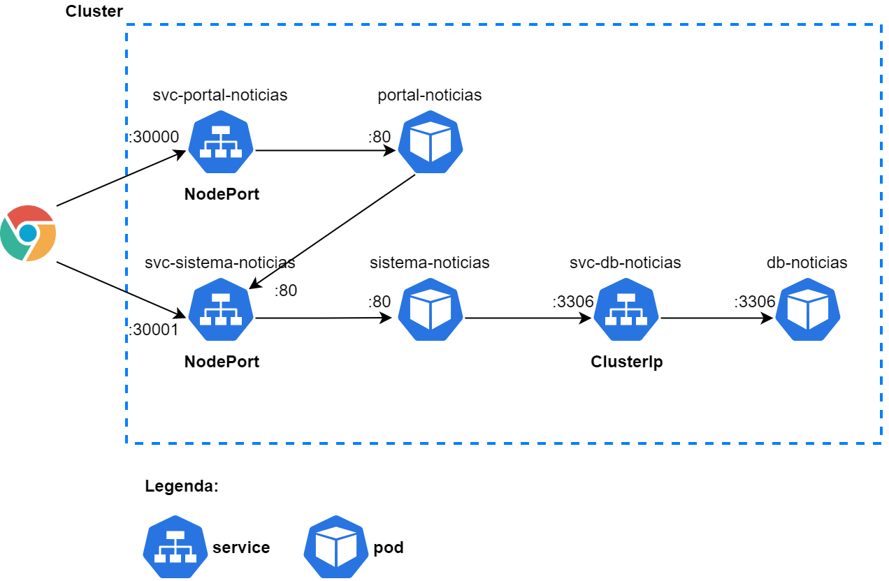

# Curso de Kubernetes

Curso introdutório de Kubernetes.

O que foi utilizado para realizar o curso:
- Docker 20.10.6;
- Kubernetes habilitado (caso do Docker Desktop em ambiente Windows).

Conceitos estudados:
- Comandos básicos com `kubectl`;
- *Pods*;
- *Nodes* e *Control Pane*;
- *Services* e seus tipos: *ClusterIP*, *NodeIP* e *LoadBalancer*;
- *ConfigMap*.

Os arquivos descrevem a configuração necessária para montar o cluster abaixo

Curso realizada na plataforma Alura, podendo ser acessado por este [link](https://cursos.alura.com.br/course/kubernetes-pods-services-configmap).
